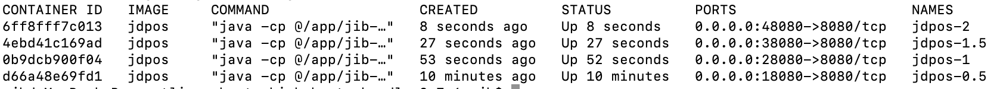
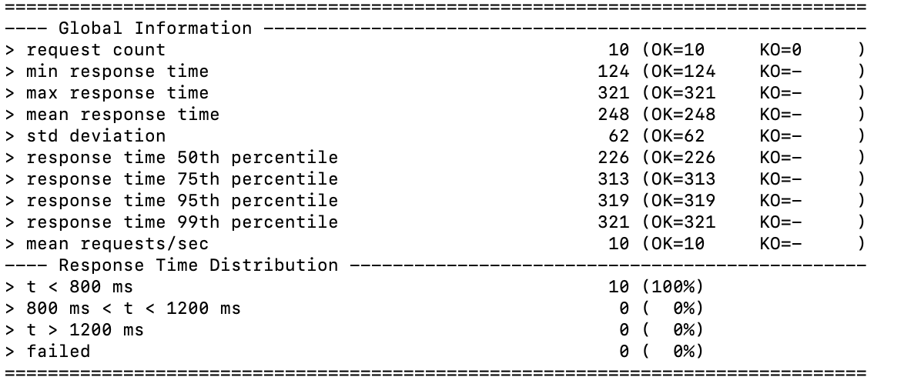
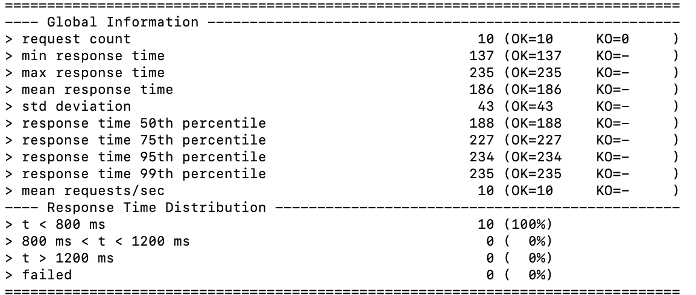
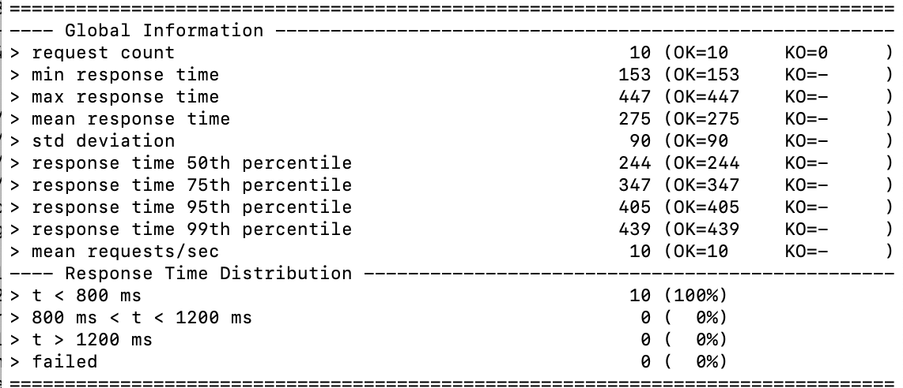
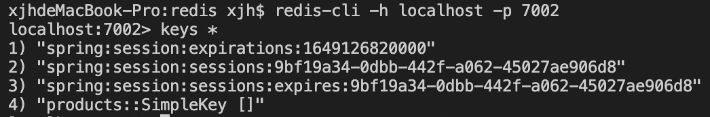

1. 首先将项目打包成一个docker镜像，然后在docker中构造四个进程，分别被分配0.5，1，1.5，2个cpu资源。如下图所示：

然后分别用gatling分别在18080-48080这四个端口上进行压力测试（我每组设了10个请求），结果如下：

cpu=0.5

cpu=1

cpu=1.5

cpu=2

    不过直接将原项目打包成docker镜像再用gatling模拟运行会遇到premature close的问题，看了群友们的讨论，似乎是session没有创建的问题，于是在controller的方法中加入HttpServletRequest的参数，并调用其getSession(true)方法，解决了问题。

2. 重新构造四个被分配0.5的cpu资源的容器进程，分别映射到8081，8082，8083，8084四个端口，按照课件的写法写好haproxy配置文件，启动haproxy，再启动gatling（还是模拟10个用户），结果如下：

可以看到，平均用时275ms，而上面只有一个cpu=0.5的容器运行平均时间为616ms，水平扩展加上负载均衡确实起到了效果。

3. 安装redis，按照课件的写法用脚本搭建redis集群。先配置cache，将getProducts方法注解为Cacheable，添加cache依赖。在第一次访问页面之后，接下来的访问速度就大大加快。接着配置session，在Controller中添加HttpSession成员，同时将cart放入session中，不再让cart成为独立的组件。第一次访问时新建cart放入session，接下来每次都从这个session中拿出cart。在redis集群中验证，发现缓存和会话都保存到了7002端口上的redis。
